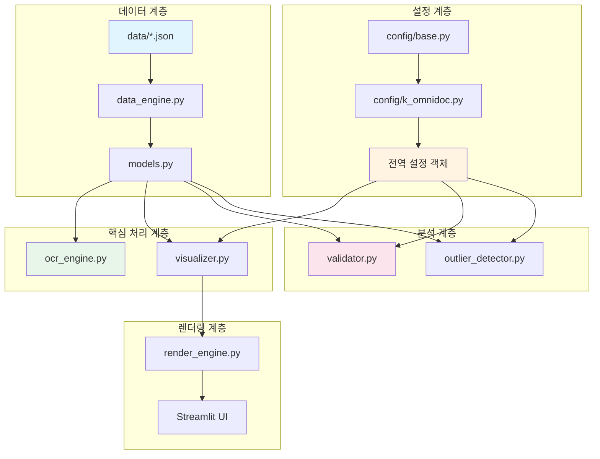
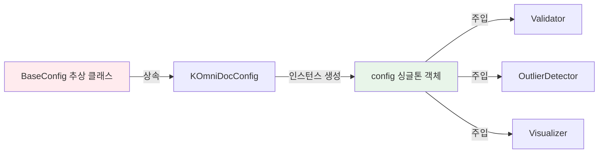
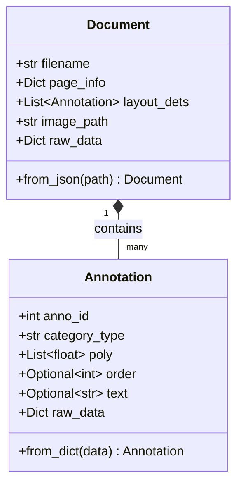
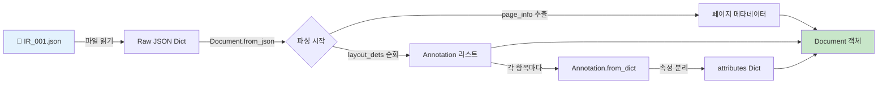
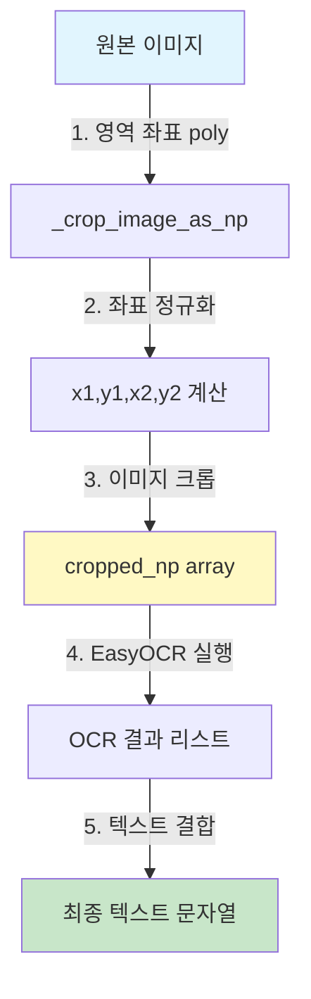
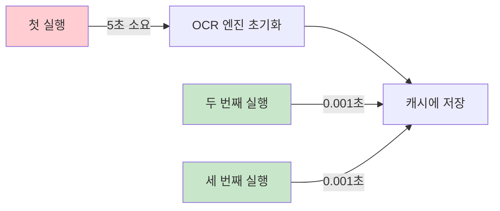
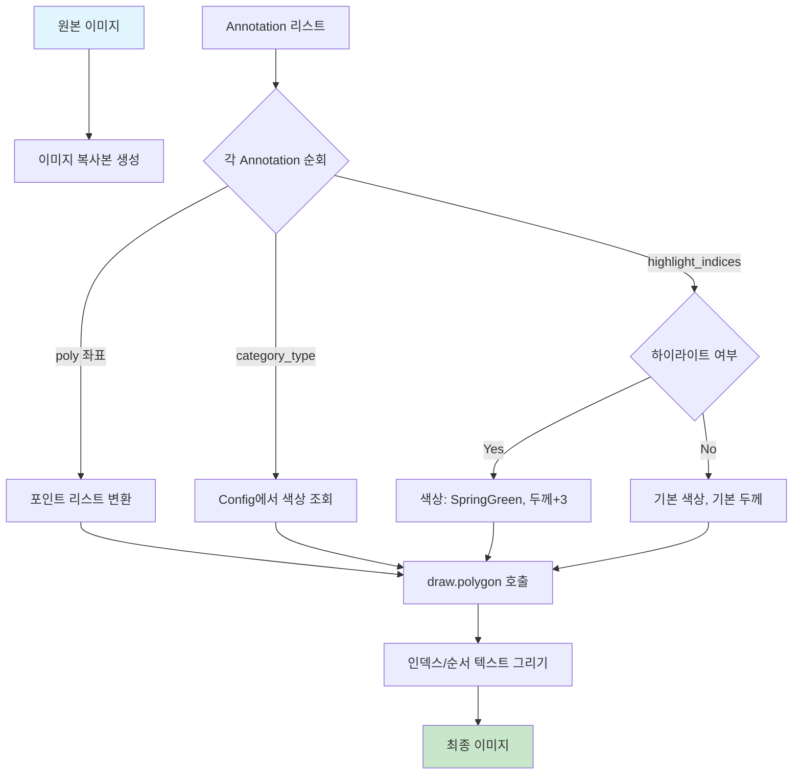
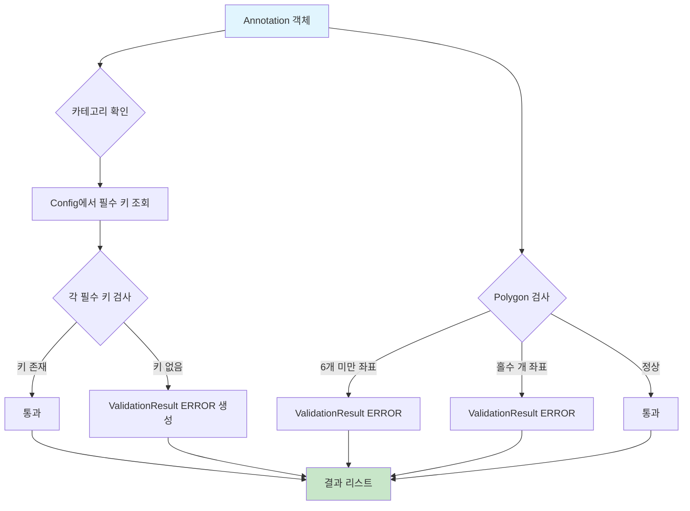
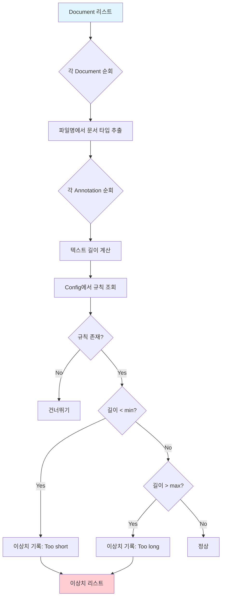
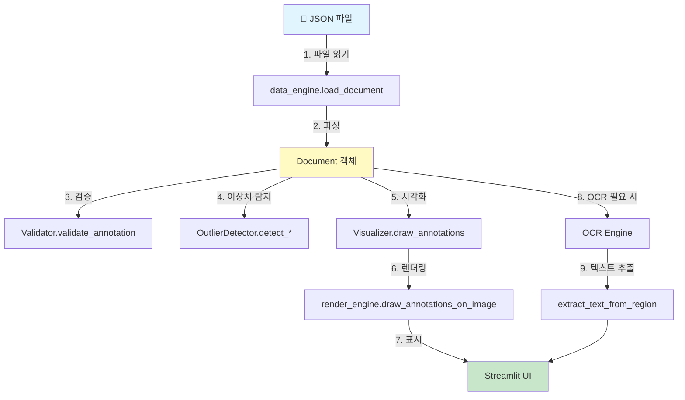

# 📚 K-Omnidoc Benchmark 코드 학습 가이드

> 이 가이드는 4가지 효과적인 학습법을 적용하여 프로젝트 코드를 깊이 있게 이해하도록 돕습니다.
> 
> **학습법:**
> 1. 🧒 **12살 비유**: 어려운 개념을 현실 세계 비유로 설명
> 2. 🤔 **대안 질문**: "왜 다른 방법은 안 돼?" 반문하기
> 3. 📊 **차이점 분석**: 핵심 기술의 차이점 중심 이해
> 4. 🔍 **중간 과정**: 데이터 흐름과 변환 과정 시각화

---

## 🏗️ 프로젝트 전체 아키텍처



---

## 📦 모듈별 상세 분석

### 1️⃣ Config 모듈: 프로젝트의 "설정 관리자"

#### 🧒 12살에게 설명하기

> **비유**: 학교 규칙을 생각해봐요!
> 
> - `BaseConfig`는 "모든 학교가 따라야 하는 기본 규칙" (예: 수업 시간, 점심시간)
> - `KOmniDocConfig`는 "우리 학교만의 특별한 규칙" (예: 교복 색깔, 동아리 규칙)
> 
> 만약 새로운 학교(프로젝트)를 만들고 싶다면, 기본 규칙(`BaseConfig`)을 상속받아서 우리 학교만의 규칙을 추가하면 돼요!

#### 📋 핵심 코드 분석

**[base.py](../src/config/base.py)**

```python
class BaseConfig(ABC):
    """모든 프로젝트 설정의 기본 클래스"""
    
    @property
    @abstractmethod
    def CATEGORY_COLORS(self) -> Dict[str, str]:
        """각 카테고리별 색상 정의 (필수 구현)"""
        pass
    
    @property
    @abstractmethod
    def REQUIRED_KEYS(self) -> Dict[str, List[str]]:
        """카테고리별 필수 키 정의 (필수 구현)"""
        pass
```

**🔍 중간 과정 시각화**



**[k_omnidoc.py](../src/config/k_omnidoc.py)**

```python
class KOmniDocConfig(BaseConfig):
    @property
    def CATEGORY_COLORS(self) -> Dict[str, str]:
        return {
            "title": "#FF6347",        # 토마토 레드
            "text_block": "#4169E1",   # 로얄 블루
            "figure": "#2E8B57",       # 바다 녹색
            # ... 11개 카테고리 색상 정의
        }
```

#### 🤔 왜 다른 방법은 안 돼?

**Q1: 왜 추상 클래스(ABC)를 사용했나요? 그냥 일반 클래스로 상속하면 안 되나요?**

| 방법 | 장점 | 단점 |
|------|------|------|
| **추상 클래스 (현재 방식)** | ✅ 필수 메서드 구현 강제<br>✅ 인터페이스 명확<br>✅ 실수 방지 | ❌ 약간 복잡함 |
| 일반 클래스 상속 | ✅ 간단함 | ❌ 필수 메서드 누락 가능<br>❌ 런타임 에러 발생 위험 |

**결론**: 추상 클래스를 사용하면 새로운 프로젝트 설정을 만들 때 `CATEGORY_COLORS`나 `REQUIRED_KEYS`를 깜빡하고 구현하지 않으면 **코드 실행 전에** 에러가 발생해서 실수를 방지할 수 있어요!

**Q2: 왜 `@property` 데코레이터를 사용했나요? 그냥 변수로 정의하면 안 되나요?**

```python
# 방법 1: 변수 (X)
class Config:
    CATEGORY_COLORS = {"title": "#FF6347"}  # 외부에서 수정 가능!

# 방법 2: @property (O - 현재 방식)
class Config:
    @property
    def CATEGORY_COLORS(self):
        return {"title": "#FF6347"}  # 읽기 전용!
```

**결론**: `@property`를 사용하면 설정 값을 **읽기 전용**으로 만들어서 실수로 수정하는 것을 방지할 수 있어요!

#### 📊 차이점 분석: BaseConfig vs KOmniDocConfig

| 특징 | BaseConfig | KOmniDocConfig |
|------|------------|----------------|
| **역할** | 추상 인터페이스 정의 | 구체적 구현 |
| **CATEGORY_COLORS** | 추상 메서드 (구현 필수) | 11개 카테고리 색상 정의 |
| **REQUIRED_KEYS** | 추상 메서드 (구현 필수) | 6개 그룹별 필수 키 정의 |
| **TEXT_LENGTH_RULES** | 빈 딕셔너리 반환 | PP/PR/DEFAULT 규칙 정의 |
| **BBOX_SIZE_RULES** | 빈 딕셔너리 반환 | DEFAULT 규칙 정의 |
| **특별 메서드** | 없음 | `get_doc_type_from_filename()` |

---

### 2️⃣ Core 모듈: 프로젝트의 "심장"

#### 🧒 12살에게 설명하기

> **비유**: 도서관 시스템을 생각해봐요!
> 
> - `models.py`: 책의 정보를 기록하는 "도서 카드" (제목, 저자, 위치 등)
> - `ocr_engine.py`: 책에 쓰인 글자를 읽어주는 "독서 로봇"
> - `visualizer.py`: 책의 위치를 지도에 표시해주는 "안내 시스템"

#### 📋 models.py: 데이터 모델

**핵심 클래스 구조**



**🔍 중간 과정: JSON → Python 객체 변환**



**실제 데이터 흐름 예시**

```python
# 입력: JSON 파일
{
    "page_info": {"width": 1654, "height": 2339, "image_path": "IR_001.jpg"},
    "layout_dets": [
        {
            "anno_id": 0,
            "category_type": "title",
            "poly": [100, 200, 500, 200, 500, 300, 100, 300],
            "text": "문서 제목",
            "attribute.text_language": "ko"
        }
    ]
}

# 중간 단계 1: Document.from_json() 호출
doc = Document.from_json("IR_001.json")

# 중간 단계 2: Annotation.from_dict() 호출 (각 layout_det마다)
ann = Annotation.from_dict({
    "anno_id": 0,
    "category_type": "title",
    "poly": [100, 200, 500, 200, 500, 300, 100, 300],
    "text": "문서 제목",
    "attribute.text_language": "ko"
})

# 출력: Python 객체
ann.anno_id          # 0
ann.category_type    # "title"
ann.poly             # [100, 200, 500, 200, 500, 300, 100, 300]
ann.text             # "문서 제목"
ann.attributes       # {"attribute.text_language": "ko"}
```

#### 🤔 왜 다른 방법은 안 돼?

**Q: 왜 `@dataclass`를 사용했나요? 그냥 일반 클래스로 만들면 안 되나요?**

```python
# 방법 1: 일반 클래스 (X)
class Annotation:
    def __init__(self, anno_id, category_type, poly, ...):
        self.anno_id = anno_id
        self.category_type = category_type
        self.poly = poly
        # ... 10줄 이상의 반복 코드

# 방법 2: @dataclass (O - 현재 방식)
@dataclass
class Annotation:
    anno_id: int
    category_type: str
    poly: List[float]
    # 자동으로 __init__, __repr__, __eq__ 생성!
```

**장점 비교**

| 특징 | 일반 클래스 | @dataclass |
|------|------------|------------|
| 코드 길이 | 길다 (20줄+) | 짧다 (5줄) |
| `__init__` | 수동 작성 | 자동 생성 |
| `__repr__` | 수동 작성 | 자동 생성 |
| Type Hints | 선택 사항 | 필수 (명확함) |

**Q: 왜 `raw_data`를 따로 저장하나요?**

**이유**: JSON 구조가 프로젝트마다 다를 수 있어요. `raw_data`에 원본을 보존하면:
- ✅ 예상치 못한 필드도 보존 가능
- ✅ 디버깅 시 원본 데이터 확인 가능
- ✅ 나중에 새로운 필드 추가 시 유연하게 대응

---

#### 📋 ocr_engine.py: OCR 엔진

**🔍 중간 과정: 이미지 → 텍스트 추출**



**실제 데이터 변환 예시**

```python
# 입력 1: 이미지 경로
image_path = "IR_001.jpg"  # 1654x2339 픽셀

# 입력 2: 바운딩 박스 좌표 (8개 점)
bbox = [100, 200, 500, 200, 500, 300, 100, 300]

# 중간 단계 1: 좌표 정규화
xs = [100, 500, 500, 100]  # x 좌표들
ys = [200, 200, 300, 300]  # y 좌표들
x1, y1 = min(xs), min(ys)  # (100, 200)
x2, y2 = max(xs), max(ys)  # (500, 300)

# 중간 단계 2: 이미지 크롭
cropped = image.crop((100, 200, 500, 300))  # 400x100 픽셀 영역

# 중간 단계 3: numpy 배열 변환
cropped_np = np.array(cropped)  # shape: (100, 400, 3)

# 중간 단계 4: EasyOCR 실행
result = reader.readtext(cropped_np, detail=0)
# result = ["문서", "제목"]

# 출력: 최종 텍스트
final_text = " ".join(result)  # "문서 제목"
```

#### 🤔 왜 다른 방법은 안 돼?

**Q: 왜 EasyOCR을 사용했나요? Tesseract나 다른 OCR은 안 되나요?**

| OCR 엔진 | 장점 | 단점 | 한국어 지원 |
|----------|------|------|-------------|
| **EasyOCR** (현재) | ✅ 딥러닝 기반 (정확도 높음)<br>✅ 한국어 우수<br>✅ 설치 간편 | ❌ 속도 느림<br>❌ GPU 권장 | ⭐⭐⭐⭐⭐ |
| Tesseract | ✅ 빠름<br>✅ 가벼움 | ❌ 한국어 정확도 낮음<br>❌ 설정 복잡 | ⭐⭐⭐ |
| PaddleOCR | ✅ 매우 빠름<br>✅ 정확도 높음 | ❌ 설치 복잡<br>❌ 의존성 많음 | ⭐⭐⭐⭐ |

**결론**: K-Omnidoc은 한국어 문서가 많아서 **정확도**가 가장 중요해요. EasyOCR이 한국어 인식률이 가장 좋아서 선택했어요!

**Q: 왜 `@st.cache_resource`를 사용했나요?**

```python
@st.cache_resource
def get_ocr_engine() -> Optional[easyocr.Reader]:
    reader = easyocr.Reader(['ko', 'en'], gpu=use_gpu)
    return reader
```

**이유**:
- OCR 엔진 초기화는 **매우 느려요** (5~10초)
- Streamlit은 코드를 **매번 재실행**해요
- `@st.cache_resource`를 사용하면 **한 번만 초기화**하고 재사용해요!



---

#### 📋 visualizer.py: 시각화 엔진

**🔍 중간 과정: 어노테이션 → 이미지 위 박스 그리기**



**실제 그리기 과정 예시**

```python
# 입력 1: 원본 이미지
image = Image.open("IR_001.jpg")  # 1654x2339

# 입력 2: Annotation
ann = Annotation(
    anno_id=0,
    category_type="title",
    poly=[100, 200, 500, 200, 500, 300, 100, 300]
)

# 중간 단계 1: 색상 조회
color = config.get_color("title")  # "#FF6347" (토마토 레드)

# 중간 단계 2: 좌표 변환
poly = [100, 200, 500, 200, 500, 300, 100, 300]
points = [(100, 200), (500, 200), (500, 300), (100, 300)]

# 중간 단계 3: 다각형 그리기
draw.polygon(points, outline="#FF6347", width=3)

# 중간 단계 4: 인덱스 텍스트 그리기
draw.text((100, 180), "0", fill="#FF6347", font=font)

# 출력: 박스가 그려진 이미지
```

#### 🤔 왜 다른 방법은 안 돼?

**Q: 왜 PIL(Pillow)를 사용했나요? OpenCV는 안 되나요?**

| 라이브러리 | 장점 | 단점 | 적합성 |
|-----------|------|------|--------|
| **PIL/Pillow** (현재) | ✅ 간단한 API<br>✅ Streamlit 호환 우수<br>✅ 이미지 객체 직접 반환 | ❌ 성능 약간 느림 | ⭐⭐⭐⭐⭐ |
| OpenCV | ✅ 빠름<br>✅ 고급 기능 많음 | ❌ BGR 색상 (혼란)<br>❌ Streamlit 변환 필요 | ⭐⭐⭐ |

**결론**: Streamlit에서 이미지를 표시할 때 PIL 이미지를 그대로 사용할 수 있어서 편리해요!

---

### 3️⃣ Analysis 모듈: 프로젝트의 "품질 검사관"

#### 🧒 12살에게 설명하기

> **비유**: 공장의 품질 검사를 생각해봐요!
> 
> - `validator.py`: "필수 부품이 다 있는지 확인하는 검사원" (예: 자동차에 바퀴 4개, 핸들 1개 있는지)
> - `outlier_detector.py`: "이상한 제품을 찾아내는 검사원" (예: 너무 크거나 작은 제품)

#### 📋 validator.py: 규칙 기반 검증

**🔍 중간 과정: Annotation → 검증 결과**



**실제 검증 예시**

```python
# 입력: Annotation
ann = Annotation(
    anno_id=0,
    category_type="text_block",
    poly=[100, 200, 500, 300],  # ❌ 4개만 (최소 6개 필요)
    text="안녕하세요",
    raw_data={
        "anno_id": 0,
        "category_type": "text_block",
        "poly": [100, 200, 500, 300],
        "text": "안녕하세요"
        # ❌ "attribute.text_language" 누락
    }
)

# 검증 실행
validator = Validator(config)
results = validator.validate_annotation(ann)

# 출력: 검증 결과
results = [
    ValidationResult(
        rule_id="missing_key",
        severity=Severity.ERROR,
        message="Missing required key: attribute.text_language"
    ),
    ValidationResult(
        rule_id="invalid_poly",
        severity=Severity.ERROR,
        message="Polygon requires at least 3 points"
    )
]
```

#### 🤔 왜 다른 방법은 안 돼?

**Q: 왜 `Enum`을 사용해서 `Severity`를 정의했나요? 그냥 문자열 "ERROR"를 쓰면 안 되나요?**

```python
# 방법 1: 문자열 (X)
severity = "ERROR"  # 오타 가능: "EROR", "error"

# 방법 2: Enum (O - 현재 방식)
class Severity(Enum):
    INFO = auto()
    WARNING = auto()
    ERROR = auto()

severity = Severity.ERROR  # IDE 자동완성, 오타 방지!
```

**장점**:
- ✅ IDE 자동완성
- ✅ 오타 방지
- ✅ 타입 안정성

---

#### 📋 outlier_detector.py: 이상치 탐지

**🔍 중간 과정: 텍스트 길이 이상치 탐지**



**실제 이상치 탐지 예시**

```python
# 입력: Document (논문 타입)
doc = Document(
    filename="PP_001.json",  # PP = 논문
    layout_dets=[
        Annotation(anno_id=0, category_type="title", text="제목"),  # 2글자
        Annotation(anno_id=1, category_type="text_block", text="본문입니다"),  # 5글자
    ]
)

# 중간 단계 1: 문서 타입 추출
doc_type = config.get_doc_type_from_filename("PP_001.json")  # "PP"

# 중간 단계 2: 규칙 조회
rule = config.TEXT_LENGTH_RULES["PP"]["title"]  # (5, 150, "논문 제목은 보통 5~150자")

# 중간 단계 3: 검사
text_len = len("제목")  # 2
min_len, max_len = 5, 150
# 2 < 5 → 이상치!

# 출력: 이상치 리스트
outliers = [
    {
        'file': 'PP_001.json',
        'doc_type': 'PP',
        'anno_id': 0,
        'category': 'title',
        'length': 2,
        'min': 5,
        'max': 150,
        'reason': 'Too short (min 5)'
    }
]
```

#### 🤔 왜 다른 방법은 안 돼?

**Q: 왜 통계 기반 이상치 탐지(Z-score, IQR)를 사용하지 않았나요?**

| 방법 | 장점 | 단점 | 적합성 |
|------|------|------|--------|
| **규칙 기반** (현재) | ✅ 도메인 지식 반영<br>✅ 해석 쉬움<br>✅ 일관성 | ❌ 규칙 수동 정의 필요 | ⭐⭐⭐⭐⭐ |
| 통계 기반 (Z-score) | ✅ 자동화<br>✅ 데이터 기반 | ❌ 도메인 지식 무시<br>❌ 정규분포 가정 | ⭐⭐ |
| ML 기반 (Isolation Forest) | ✅ 복잡한 패턴 탐지 | ❌ 해석 어려움<br>❌ 학습 데이터 필요 | ⭐⭐⭐ |

**결론**: 문서 타입별로 명확한 규칙이 있어서 (예: 논문 제목은 5~150자) 규칙 기반이 가장 적합해요!

---

## 🔄 전체 데이터 흐름



---

## 💡 핵심 학습 포인트

### 1. 설계 패턴

| 패턴 | 적용 위치 | 목적 |
|------|----------|------|
| **추상 팩토리** | `BaseConfig` | 프로젝트별 설정 확장 |
| **싱글톤** | `config = KOmniDocConfig()` | 전역 설정 객체 |
| **의존성 주입** | `Validator(config)` | 설정 주입으로 유연성 확보 |
| **데이터 클래스** | `@dataclass Annotation` | 보일러플레이트 코드 제거 |

### 2. 성능 최적화

| 기법 | 적용 위치 | 효과 |
|------|----------|------|
| **캐싱** | `@st.cache_resource` | OCR 엔진 재사용 (5초 → 0.001초) |
| **지연 로딩** | `get_ocr_engine()` | 필요할 때만 초기화 |
| **원본 데이터 보존** | `raw_data` | 재파싱 불필요 |

### 3. 확장성


---

## 🎯 학습 체크리스트

### Config 모듈
- [ ] `BaseConfig`의 추상 메서드를 모두 설명할 수 있나요?
- [ ] `@property` 데코레이터의 장점을 3가지 이상 말할 수 있나요?
- [ ] 새로운 프로젝트 설정 클래스를 직접 만들 수 있나요?

### Core 모듈
- [ ] JSON 파일이 `Document` 객체로 변환되는 과정을 단계별로 설명할 수 있나요?
- [ ] `@dataclass`의 장점을 일반 클래스와 비교하여 설명할 수 있나요?
- [ ] OCR 엔진이 이미지에서 텍스트를 추출하는 과정을 그림으로 그릴 수 있나요?
- [ ] `@st.cache_resource`가 성능을 어떻게 개선하는지 설명할 수 있나요?

### Analysis 모듈
- [ ] `Validator`와 `OutlierDetector`의 차이를 설명할 수 있나요?
- [ ] 규칙 기반 이상치 탐지의 장단점을 말할 수 있나요?
- [ ] `Enum`을 사용하는 이유를 설명할 수 있나요?

---

## 🚀 다음 단계 학습 제안

1. **실습**: 새로운 카테고리 추가해보기
   - `KOmniDocConfig`에 새 카테고리 색상 추가
   - 해당 카테고리의 필수 키 정의
   - 검증 규칙 추가

2. **확장**: 새로운 문서 타입 지원
   - `TEXT_LENGTH_RULES`에 새 문서 타입 추가
   - `get_doc_type_from_filename` 로직 확장

3. **최적화**: OCR 성능 개선
   - GPU 사용 여부에 따른 성능 비교
   - 배치 처리 구현

4. **테스트**: 단위 테스트 작성
   - `Annotation.from_dict()` 테스트
   - `Validator.validate_annotation()` 테스트
   - `OutlierDetector` 테스트

---

## 📚 참고 자료

- [Python @dataclass 공식 문서](https://docs.python.org/3/library/dataclasses.html)
- [Python ABC (추상 클래스) 가이드](https://docs.python.org/3/library/abc.html)
- [EasyOCR GitHub](https://github.com/JaidedAI/EasyOCR)
- [Streamlit 캐싱 가이드](https://docs.streamlit.io/library/advanced-features/caching)
